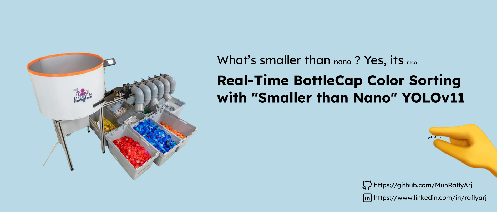
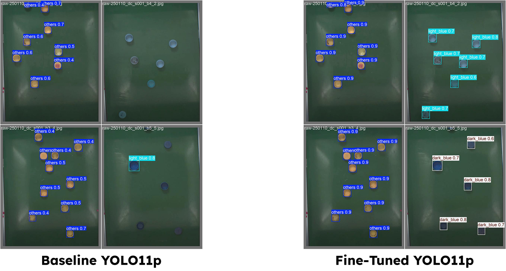

# bsort: Bottle Cap Sorting AI Pipeline

[](https://github.com/muhraflyarj/bottle-cap-color-detection/actions/workflows/ci.yml)


***

## 📌 Project Overview

**bsort** addresses the challenge of effective plastic recycling by automating the separation of bottle caps, which are often made of different plastics (e.g., PP vs. PET) than the bottles themselves.

* **Goal:** Build a high-speed computer vision system to detect and classify bottle caps into **Light Blue**, **Dark Blue**, and **Others**.
* **Model:** Custom **YOLOv11p (Pico)**, a lightweight architecture optimized for speed without sacrificing essential accuracy.
* **Deployment Support:** The model supports standard **PyTorch (`.pt`)** inference for flexibility and **NVIDIA TensorRT** for maximum throughput in production environments.
* **Target Constraint:** Designed to achieve **<10ms** latency per frame on edge accelerators (e.g., Raspberry Pi 5 + Hailo-8L).

## 🧠 The "YOLOv11-Pico" Architecture & Methodology

To meet the strict latency requirements, we developed a custom model variant called **YOLOv11p (Pico)**. This model is scaled down significantly compared to the standard YOLOv11n (Nano), reducing the parameter count to just **1.5M** while maintaining high throughput.

> 📓 **Deep Dive:** For a step-by-step explanation of the model development, experimentation, and training logs, please refer to the Jupyter Notebook at [`notebooks/experiment.ipynb`](notebooks/experiment.ipynb).

### The "Cold Start" Challenge
Training this custom architecture from scratch presented a major challenge. Since the provided project dataset was extremely small (~20 images), the model failed to generalize when trained with random initialization, achieving a low **0.46 mAP**.

### Solution: Two-Stage Transfer Learning
To overcome the data scarcity, we implemented a robust two-stage training strategy:

1.  **Stage 1 (Pretraining):** We trained the `yolov11p` architecture on a large **Public Dataset** containing generic bottle caps. This allowed the model to learn fundamental object localization and shape features.
2.  **Stage 2 (Fine-tuning):** We transferred these learned weights to our specific challenge dataset to teach the model to distinguish between **Light Blue** and **Dark Blue** caps.

## 📊 Performance Results

We evaluated four different configurations to find the optimal balance between speed and accuracy.

### 1. Accuracy Comparison

The **YOLOv11p (Pretrained + Finetuned)** was selected as the final model because it matches the accuracy of larger models while running significantly faster.



| Model Variation | Initialization Strategy | mAP @ 50-95 | Recall | Params | Verdict |
| :--- | :--- | :--- | :--- | :--- | :--- |
| **YOLOv11s** | COCO Pretrained | **0.9172** | 0.97 | 9.5M | Too Heavy / Slow |
| **YOLOv11n** | COCO Pretrained | 0.9018 | 0.92 | 2.6M | Baseline |
| **YOLOv11p (Pico)** | Random Weights | 0.4611 | 0.39 | **1.5M** | ❌ Failed (No Learning) |
| **YOLOv11p (Pico)** | **Transfer Learning** | **0.8742** | **1.00** | **1.5M** | **✅ Selected** |

### 2. Inference Speed Benchmark (PC)

We benchmarked the models using **NVIDIA TensorRT** to demonstrate peak inference performance.

**Benchmark Hardware:**
* **OS:** Windows 11
* **CPU:** Ryzen 7 8700f
* **RAM:** 64GB
* **GPU:** NVIDIA GeForce RTX 5070 Ti

| Model | Format | Latency (per frame) |
| :--- | :--- | :--- |
| **YOLOv11p (Pico)** | **TensorRT** | **1.7 ms** 🚀 |
| YOLOv11n (Nano) | TensorRT | 2.0 ms |
| YOLOv11s (Small) | TensorRT | 2.4 ms |

### 3. Edge Device Feasibility (Proof of <10ms)

While we developed on a PC, the target deployment is **Raspberry Pi 5 + Hailo-8L AI Accelerator**. Since we do not have physical access to this specific device, we use validated benchmarks of the heavier **YOLOv8** architecture as a baseline to prove feasibility.

**Reference Hardware:** Raspberry Pi 5 + Hailo-8L (13 TOPS)
**Reference Benchmark:** YOLOv8n (Standard Nano)

| Model Architecture | Parameters | Known Latency (Hailo-8L) | Estimated Latency |
| :--- | :--- | :--- | :--- |
| YOLOv8s (Small) | 11.1M | ~12.0 ms | Too Slow |
| **YOLOv8n (Nano)** | **3.2M** | **~5.2 ms** | **Fits Constraint (<10ms)** |
| **YOLOv11p (Pico)** | **1.5M** | **N/A** | **~2.5 - 3.0 ms (Projected)** |

**Conclusion:**
Since the standard **YOLOv8n (3.2M params)** already achieves **~5.2ms** on the target hardware, our **YOLOv11p (1.5M params)**—which is 53% smaller—will theoretically run significantly faster, comfortably clearing the **5-10ms** requirement for real-time sorting.

## 🛠️ Installation

### Local Setup
To set up the project locally for development or testing:

1.  **Clone the repository:**
    ```bash
    git clone [https://github.com/muhraflyarj/bottle-cap-color-detection.git](https://github.com/muhraflyarj/bottle-cap-color-detection.git)
    cd bottle-cap-color-detection
    ```

2.  **Create a Virtual Environment (Recommended):**
    ```bash
    python -m venv venv
    source venv/bin/activate  # On Windows: venv\Scripts\activate
    ```

3.  **Install dependencies:**
    ```bash
    pip install -e .
    ```
    *Note: This installs the `bsort` package in editable mode, allowing you to run CLI commands directly.*

---

## 🚀 Usage

This project uses a custom Command Line Interface (CLI) named `bsort`.

### 1. Train the Model
To reproduce the training experiments (including the transfer learning steps), run:

```bash
bsort train --config train-settings.yaml
```

*Configuration parameters (epochs, batch size, dataset paths) can be modified in `train-settings.yaml`.*

### 2\. Run Inference

To detect bottle caps in an image or video:

```bash
bsort infer --config infer-settings.yaml
```

You can also override the source directly via the CLI:

```bash
bsort infer --config infer-settings.yaml --source ./datasets/sample.jpg
```

## 🐳 Docker Support

This project includes a Docker container optimized for size (CPU-only PyTorch). The image is automatically built and pushed via GitHub Actions.

### 1\. Pull the Image

```bash
docker pull YOUR_DOCKER_USERNAME/bsort:latest
```

### 2\. Run Inference in Docker

To run the container, mount your current directory (`$(pwd)`) to the `/app` folder inside the container.

```bash
docker run -it --rm -v $(pwd):/app YOUR_DOCKER_USERNAME/bsort:latest infer --config infer-settings.yaml
```

*(Note: If building locally, use `docker build -f docker/Dockerfile-bsort -t bsort .`)*

-----

## 📂 Project Structure

```text
.
├── bsort/                    # Main package source code
│   ├── utils/                # Utility functions (data prep, logging, file ops)
│   ├── cli.py                # CLI entry point implementation
│   ├── train.py              # Training logic
│   └── infer.py              # Inference logic
├── ultralytics/              # Core YOLO library (Modified/Vendored)
│   ├── nn/                   # Neural network modules
│   ├── models/               # Model definitions (including Pico)
│   └── ...
├── docker/
│   ├── Dockerfile-bsort      # Docker build definition (CPU optimized)
│   └── Dockerfile-bsort-gpu  # Docker build definition (Nvidia GPU)
├── .github/workflows/        # CI/CD Pipeline definitions
├── assets/                   # Images for README and documentation
├── pyproject.toml            # Project dependencies and metadata
├── train-settings.yaml       # Training configuration parameters
├── infer-settings.yaml       # Inference configuration parameters
└── README.md                 # Project documentation
```

-----

## 🛠️ Tools & Credits

  * **Base Framework:** [Ultralytics YOLOv11](https://github.com/ultralytics/ultralytics)
  * **Experiment Tracking:** [Weights & Biases (WandB)](https://www.google.com/search?q=https://wandb.ai/)
  * **Data Management:** [Roboflow](https://roboflow.com/)
